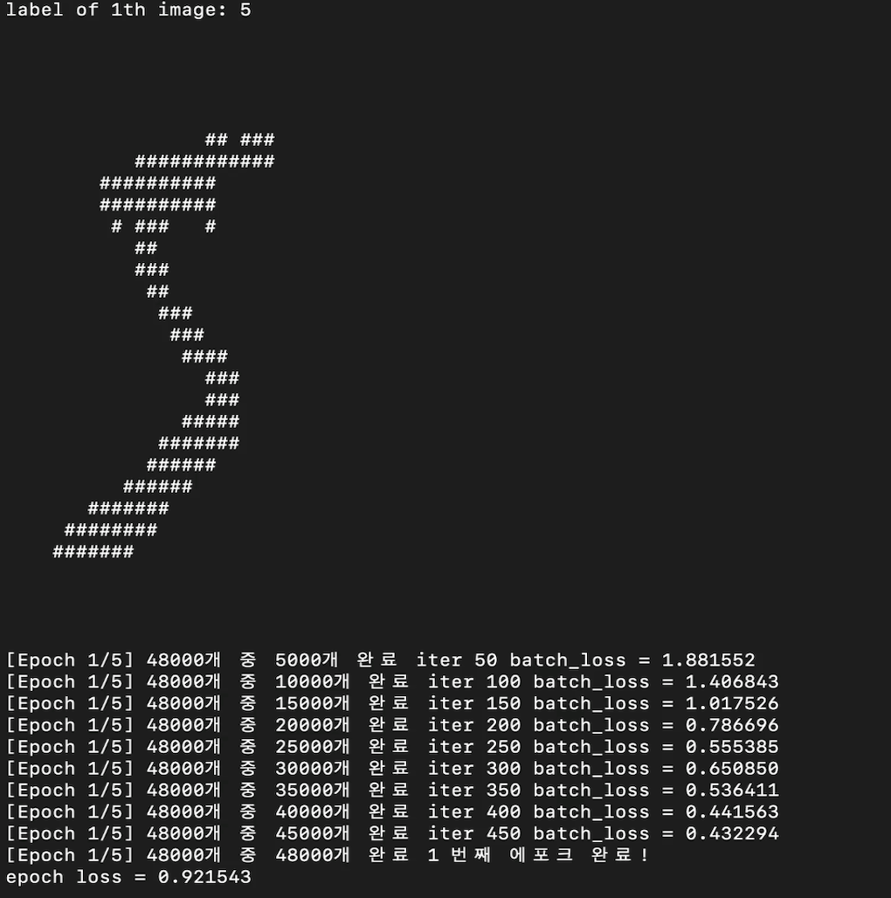
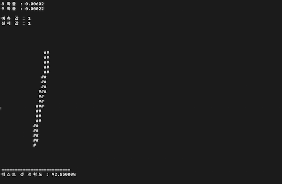

# C언어를 사용한 CNN모델 생성 및 MNIST 학습
## overview
    pytorch, tensorflow 등 딥러닝 프레임 워크를 사용하지 않고
    C언어로 파일 입출력, 모델 구축, 학습, 추론 모델을 구축 후 
    mnist 데이터 학습

    학습 데이터 32000장 
    테스트 데이터 8000장    

    결과 : 92.5% 정확도 도달

## 모델 구조
	1)  input 1x28x28
	2)  kernel conv층 32개, 커널크기 3x3, 스트라이드 1, 패딩 1
	3)  convolution 층 -> output 32x28x28
	4)  ReLU 활성화 함수
	5)  max pooling 층, 필터 크기 2x2, 스트라이드 2 -> output 32x14x14
	6)  flatten 층 -> output 32 x 14 x 14 = 6272
	7)  fully connected 층 128노드, ReLU 활성화 함수
    8)  fully connected 층 64노드, ReLU 활성화 함수
	9)  fully connected 층 10노드, softmax 활성화 함수
## 데이터 입력
    MNIST   
    - 데이터 구조 : Train data 60000개, Test data 10000개, .idx파일

    - 이미지 구조 : 28 X 28, 값 0 ~ 255

    - MNIST데이터 .idx 파일 입력

## 데이터 처리
    Normalization : [1, 255] -> [0, 1] 

## 손실함수
### Binary Cross Entropy 사용
$$
\text{Loss} = -\frac{1}{{\text{outputsize}}}
\sum_{i=1}^{\text{outputsize}}
\left[ y_i \log(\hat{y}_i) + (1 - y_i)\log(1 - \hat{y}_i) \right]
$$

## 가중치 초기화 방식
### he Initalization
$$
w \sim \mathcal{N}\left(0, \sqrt{\frac{2}{\text{fan-in}}}\right)
$$

## kernel
    Size : 3 x 3    

## 활성화 함수
    RELU : max(0, x)

## Optimizer
    Not used

## 파일 구조
```
Cproject
├─ CMakeLists.txt
├─ README.md
├─ data
│  ├─ test_images.idx3-ubyte
│  ├─ test_labels.idx1-ubyte
│  ├─ train_images.idx3-ubyte
│  └─ train_labels.idx1-ubyte
├─ include
│  ├─ calc.h
│  ├─ fread.h
│  └─ layer.h
├─ src
│  ├─ calc.c // forward, backward 계산
│  ├─ fread.c // 파일 입력
│  └─ layer.c // 모델 층 생성
└─  main.c // 학습, 추론, 테스트


```

## 학습 결과

### 훈련



### 결과
    


